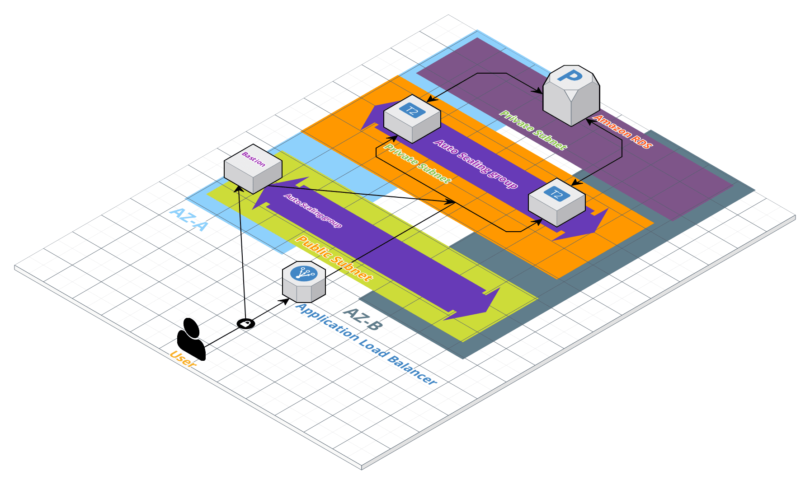

# Terraform_modules_three_tier_architecture_aws
Terraform_modules_three_tier_architecture_aws


### Tasks:
Develop infrastructure in AWS, using IaC approach with Terraform
### Services:
- RDS
- ASG
- ELB
- SG
### Requirements:
- Modules
- Remote state file
- Multi-environment

### Schema:



## How to RUN
```sh
git clone https://github.com/maksym-butusov/Terraform_modules_three_tier_architecture_aws
cd Terraform_modules_three_tier_architecture_aws/
DO NOT FORGET to change ssh keys in variables.tf
terraform init
terraform plan
terraform apply
```